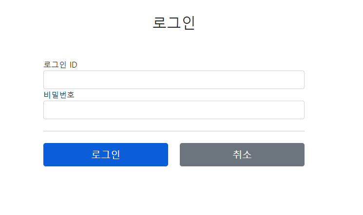
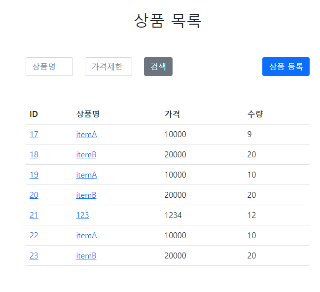

<h1>관리자 상품 관리 웹 어플리케이션</h1> 
<h3>상품관리 어플리케이션입니다. 관리자 아이디로 로그인을 하면 상품목록을 확인하고 수량과 가격을 수정 할 수 있습니다.</h3> 
<h3>관리자 아이디는 testID 비밀번호는 : 123456 으로 임의로 만들어 놨습니다.</h3>

<h3>로그인 화면 입니다. 미리 입력해둔 관리자 아이디를 이용해 로그인을 합니다.</h3> 
<h3>템플릿엔진은 타임리프를 사용했습니다. 입력하는 아이디와 비밀번호가 미리 저장되어있는 관리자 아이디, 비밀번호와 일치한다면
로그인이 성공하고 잘못된 값을 입력하면 에러메시지가 나오도록 했습니다.</h3> 

<h3>로그인을 성공하면 상품목록이 나옵니다. 수량과 가격을 확인할 수 있습니다.</h3> 
<h3>jdbc를 사용해서 데이터베이스에 저장하게 구성하였습니다.</h3> 
<h3>mybatis를 이용해서 동적쿼리를 쉽게 사용할 수 있었습니다. 동적쿼리를 이용해 조건에 맞는 아이템을 검색할 수 있습니다.</h3>

